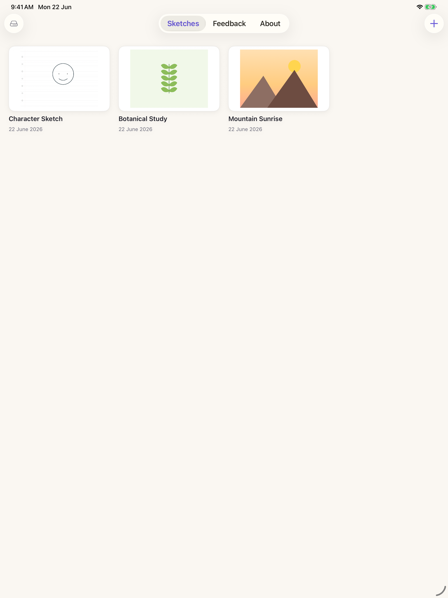

# Sketchbook

A natural drawing studio for **iPad** — sketch with pressure-sensitive brushes and Apple Pencil, work in layers, trace reference photos, use symmetry and rulers, fill with color, apply filter effects, and bring your art into the real world with **AR**. Everything syncs to your personal **iCloud**.



[](https://www.apple.com/ipados/)
[](https://swift.org)
[](https://developer.apple.com/xcode/swiftui/)
[](https://developer.apple.com/documentation/pencilkit)
[](https://developer.apple.com/augmented-reality/realitykit/)
[](#license)

## Features

| Feature | How it works |
|---------|--------------|
| ✏️ **Brushes** | Pen, Pencil, Marker, Crayon, Fountain, Monoline, Watercolor — with live stroke previews |
| ✒️ **Pencil grades** | Graphite 2H · H · HB · 2B · 4B · 6B (darkness + width) |
| 📏 **Adjustable size** | Brush & eraser size sliders; full-spectrum color picker with opacity |
| 🪣 **Color fill** | Scanline flood-fill bucket — tap any enclosed region |
| 🧽 **Eraser** | Bitmap eraser with adjustable size |
| 🪢 **Lasso** | Select, move, cut & duplicate strokes |
| ↩️ **Undo / Redo** | Full history via PencilKit's undo manager |
| 🎨 **Filter effects** | Mono, Sepia, Vibrant, Invert, Comic, Soft Blur |
| 🖌️ **Painting styles** | Oil, Watercolor, Pointillism, Mosaic (Core Image) |
| 🗂️ **Layers** | Add / duplicate / reorder / lock / hide / rename, per-layer opacity, **groups** |
| 📐 **Drawing guides** | Ruler, 1/2/3-point **perspective**, isometric & grid overlays |
| 🔁 **Symmetry guides** | Vertical, Horizontal & 4-way (kaleidoscope) live mirroring |
| ✍️ **Apple Pencil** | Palm rejection always on; optional finger drawing; haptics |
| 📄 **Templates** | Blank, **Ring File**, Ruled, Grid, Dot Grid, Isometric, Storyboard, Music Staff |
| 🖼️ **Learn by tracing** | Import a photo as an adjustable-opacity reference overlay |
| ⭐ **Favorites** | Star sketches; favorites sort to the top |
| ⚙️ **Settings** | Light / Dark / System theme, tool & new-sketch defaults |
| ☁️ **iCloud storage** | Sketches saved to your personal iCloud Documents container (local fallback) |
| 🪄 **Sketch → AR** | Place your flattened artwork onto a real surface with RealityKit |

## Tech Stack

- **SwiftUI** — app shell, gallery, editor UI, panels
- **PencilKit** — drawing canvas, ink/brush tools, eraser, ruler, palm rejection
- **Core Image** — filter effects
- **Core Graphics** — flood fill, page-template rendering, layer compositing
- **RealityKit + ARKit** — sketch-to-AR placement
- **iCloud Documents (FileManager ubiquity container)** — cross-device sync
- **PhotosUI** — reference-image import
- **XcodeGen** — project generation from `project.yml`

## Architecture

```
Sketchbook/
├── App/            SketchbookApp (entry), Info.plist, entitlements
├── Theme/          Brand tokens (Theme.swift), color-hex helpers
├── Models/         SketchDocument, Layer, BrushType, Template
├── Store/          DocumentStore — iCloud + local persistence
├── Drawing/        CanvasView (PencilKit), SymmetryEngine, FloodFill,
│                   FilterEngine, TemplateRenderer, LayerCompositor
├── AR/             ARSketchView / ARSketchScreen (RealityKit)
└── Features/
    ├── Gallery/    Browse, new-sketch sheet, duplicate, delete
    ├── Editor/     EditorView, EditorViewModel, toolbar panels
    └── About/      About + Feedback tabs (Tertiary Infotech house style)
```

Each sketch is a JSON `.sketch` document (layers store serialized `PKDrawing` data + optional raster
images). The **active** layer is a live `PKCanvasView`; inactive layers are composited to images and
stacked in z-order. Symmetry mirrors freshly drawn strokes on commit. Color fill rasterises a
snapshot, flood-fills, and composites the patch onto the active layer.

## Getting Started

Requirements: **Xcode 16+** (iOS 26 SDK), an iPad or iPad Simulator (iPadOS 17+), and
[XcodeGen](https://github.com/yonaskolb/XcodeGen) (`brew install xcodegen`).

```bash
git clone https://github.com/alfredang/sketchbookapp.git
cd sketchbookapp
xcodegen generate            # produces Sketchbook.xcodeproj from project.yml
open Sketchbook.xcodeproj     # then Run on an iPad / simulator
```

Or build from the command line:

```bash
xcodebuild -project Sketchbook.xcodeproj -scheme Sketchbook \
  -sdk iphonesimulator -destination 'platform=iOS Simulator,name=iPad Pro 11-inch (M5)' \
  build
```

> iCloud and AR require running on a real device with a signing team. In the Simulator the app
> automatically falls back to local on-device storage, and AR shows a camera-preview placement.

## Roadmap

- Undo/redo history surfaced in the toolbar
- Animated/looping AR placement and export to USDZ
- Brush studio (custom textures, stabilization, taper)
- Shared iCloud sketchbooks

## License

MIT © Tertiary Infotech Academy Pte Ltd
